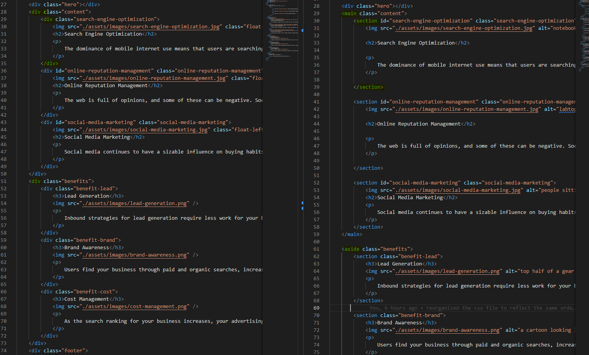

# HTML-Code-Refactor

## Description

This repository is for the Module 1 Challenge that involves refactoring HTML and CSS.  This project was undertaken to make the code base more descriptive, concise, and less repetitive as well as to test our understanding of HTML semantics and CSS selectors. This project solves the problem of organizing the code in both the HTML and CSS files so that it is easier to read and understand for when others read the files. Also, it solves the issue of improving accessibility by adding alt text to images. From this project I was able to learn how to use HTML semantics to organize HTML code and how to efficiently group class selectors together to reduce repetitive code within the CSS file. 

## Usage

Below you can see a screenshot of a side-by-side comparison of the original code base with predominantly div tags (left) and the refactored code base with proper HTML semantic elements (right). From this screenshot you can see how incorporating proper HTML semantic elements into your code can organize it so that it makes it easier to read and understand for not only yourself but others reading your code. 

Again, from this screen shot below you can a side-by-side comparison of the original CSS code base (left) and the CSS code base after class selectors were grouped together to reduce repetitive code (right). 

" alt="screenshot of two coding windows showing CSS code"

## License

MIT License

Copyright (c) [year] [fullname]

Permission is hereby granted, free of charge, to any person obtaining a copy
of this software and associated documentation files (the "Software"), to deal
in the Software without restriction, including without limitation the rights
to use, copy, modify, merge, publish, distribute, sublicense, and/or sell
copies of the Software, and to permit persons to whom the Software is
furnished to do so, subject to the following conditions:

The above copyright notice and this permission notice shall be included in all
copies or substantial portions of the Software.

THE SOFTWARE IS PROVIDED "AS IS", WITHOUT WARRANTY OF ANY KIND, EXPRESS OR
IMPLIED, INCLUDING BUT NOT LIMITED TO THE WARRANTIES OF MERCHANTABILITY,
FITNESS FOR A PARTICULAR PURPOSE AND NONINFRINGEMENT. IN NO EVENT SHALL THE
AUTHORS OR COPYRIGHT HOLDERS BE LIABLE FOR ANY CLAIM, DAMAGES OR OTHER
LIABILITY, WHETHER IN AN ACTION OF CONTRACT, TORT OR OTHERWISE, ARISING FROM,
OUT OF OR IN CONNECTION WITH THE SOFTWARE OR THE USE OR OTHER DEALINGS IN THE
SOFTWARE.

---

🏆 The previous sections are the bare minimum, and your project will ultimately determine the content of this document. You might also want to consider adding the following sections.

